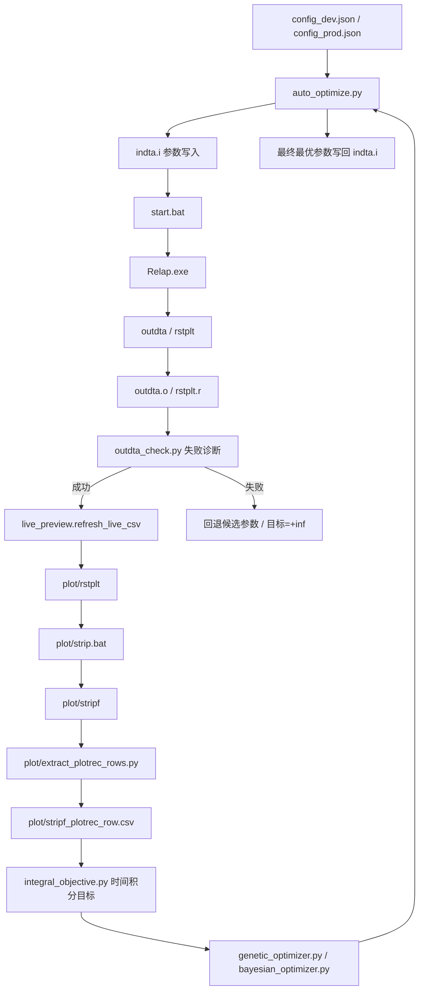
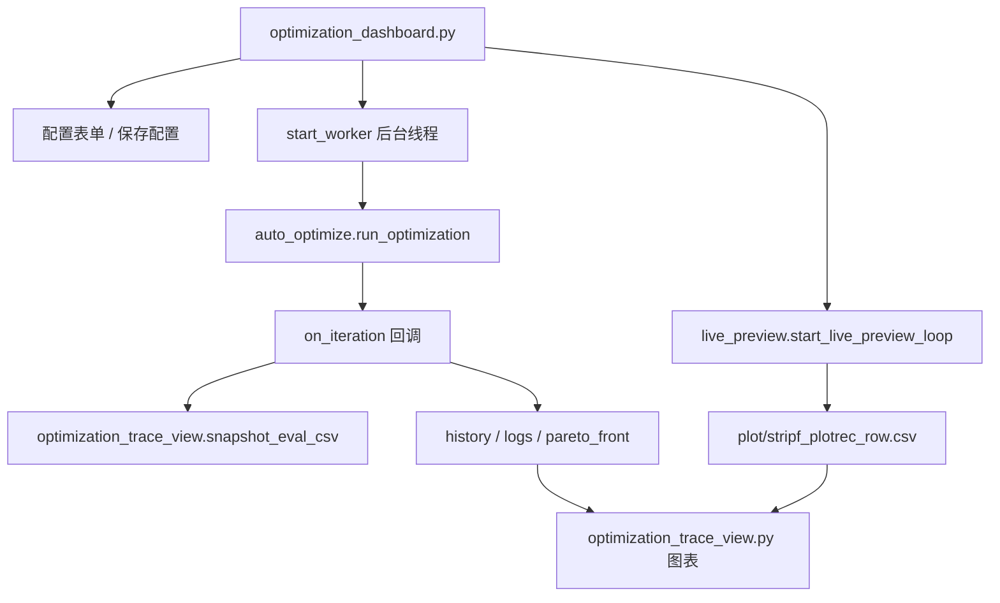

# RELAP 参数优化整合系统开发说明书

本文档用于后续开发交接和无缝切换。它描述当前文件夹内各源码、配置、批处理、输入输出文件之间的交互逻辑，以及切换环境、算法、参数、目标和展示入口时应修改的位置。

## 1. 系统定位

本系统是一个 RELAP5 参数闭环优化平台：

1. 读取 `config_dev.json` / `config_prod.json` 中的待优化参数与目标定义。
2. 按 `line_key + column_index` 修改 `indta.i` 中的控制参数。
3. 运行 `start.bat` 调用 `Relap.exe` 完成一次 RELAP 求解。
4. 检查 `outdta.o` 判断 RELAP 是否真实成功。
5. 将 `rstplt` 送入 `plot/strip.bat`，生成 `plot/stripf`。
6. 用 `plot/extract_plotrec_rows.py` 将 `stripf` 转成 `plot/stripf_plotrec_row.csv`。
7. 对 CSV 中指定列做时间积分，得到目标函数。
8. 用优化算法继续提出下一组参数。
9. 结束后把代表最优解写回 `indta.i`。
10. Streamlit 展示程序复用同一主优化入口，额外提供配置编辑、日志、快照和图形展示。

## 2. 总体数据流



Streamlit 入口的额外链路：



## 3. 文件职责总表

| 文件/目录 | 类型 | 职责 | 主要上下游 |
|---|---|---|---|
| `auto_optimize.py` | 主优化程序 | CLI 入口、配置读取、参数写入、RELAP 运行、失败恢复、目标计算、调用优化器、写回最优参数 | 读配置、改 `indta.i`、调用 `start.bat`、调用 `live_preview.py`、调用优化器 |
| `optimization_dashboard.py` | Streamlit 展示程序 | 配置编辑、启动/停止后台优化、日志、结果表格、数据可视化页 | 调用 `auto_optimize.run_optimization`、`live_preview.start_live_preview_loop`、`optimization_trace_view.py` |
| `optimization_trace_view.py` | 图形与快照工具 | 收敛曲线、Pareto 表、参数轨迹、时间序列对比、运行快照 | 被 dashboard 调用，读 `history` 与 CSV 快照 |
| `live_preview.py` | 后处理/实时预览模块 | 拷贝 `rstplt` 到 `plot/`，运行 `plot/strip.bat`，解析 `plot/stripf`，写 CSV；提供写锁 | 被主优化和 dashboard 实时预览线程调用 |
| `integral_objective.py` | 目标函数模块 | 读 CSV 时间序列，计算绝对/有符号/平方偏差积分，多目标加权和，1D 黄金分割 | 被 `auto_optimize.py` 调用 |
| `genetic_optimizer.py` | 遗传优化器 | 轻量 NSGA-II/Pareto 搜索；过滤失败评估 | 被 `auto_optimize.py` 调用 |
| `bayesian_optimizer.py` | 贝叶斯优化器 | 轻量 GP + EI 搜索，支持 1D 和 N-D | 被 `auto_optimize.py` 调用 |
| `outdta_check.py` | RELAP 成败诊断 | 从 `outdta.o` 尾部判定失败或缺失正常终止标记 | 被 `auto_optimize.check_outdta_failed` 调用 |
| `plot/extract_plotrec_rows.py` | CSV 提取器 | 从 `plot/stripf` 解析 `plotrec` 行和表头，生成 CSV | 被 `live_preview.py` 调用，可独立 CLI |
| `relap_run_dashboard.py` | 辅助运行展示 | 更偏单次 RELAP 运行/stripf 预览的旧式或辅助 Streamlit 页面 | 可独立使用，不是主优化闭环入口 |
| `config_dev.json` | 开发配置 | 当前 PID 三参数优化配置 | CLI 默认 `--env dev` 与 dashboard dev 模式读取 |
| `config_prod.json` | 生产配置模板 | 生产环境参数/目标示例 | CLI `--env prod` 与 dashboard prod 模式读取 |
| `start.bat` | 主 RELAP 批处理 | `indta.i -> indta`，运行 `Relap.exe`，复制 `outdta.o`、`rstplt.r` | 被 `auto_optimize.run_bat` 调用 |
| `plot/strip.bat` | 后处理批处理 | 用 `plot/strip.i` 读取 `rstplt`，生成 `plot/stripf` | 被 `live_preview.refresh_live_csv` 调用 |
| `tests/` | 单元测试 | 覆盖配置、目标函数、优化器、失败诊断、UI 图形辅助函数 | 使用 `unittest discover` |
| `runs/` | 运行快照目录 | dashboard 每次启动时存 `eval_###.csv` 快照 | 由 `optimization_trace_view.make_run_snapshot_dir` 创建 |
| `.codex_deps/` | 本地依赖目录 | 当前为 Streamlit/Plotly 等 UI 依赖的本地安装目录 | 运行 dashboard 时加入 `PYTHONPATH` |

## 4. 主优化程序交互逻辑

核心入口：

- CLI：`python auto_optimize.py --env dev`
- Python API：`auto_optimize.run_optimization(env="dev", ...)`
- Dashboard：`optimization_dashboard.start_worker()` 在线程中调用同一个 API

关键调用顺序：

1. `main()` 解析 `--env`。
2. `run_optimization()` 强制进入 `objective="minimize_time_integral"` 流程。
3. `run_optimization_minimize_time_integral()`：
   - `load_config()` 读取配置。
   - `validate_integral_optimization_config()` 做字段合法性校验。
   - `normalize_parameters_config()` / `normalize_objectives_config()` 兼容新旧配置 schema。
   - 定义内部 `evaluate_record()`，作为所有优化器的目标评估函数。
4. `evaluate_record(x)`：
   - 调用 `_try_relap_with_recovery()` 运行 RELAP。
   - 失败时记录 `relap_failed=True`，目标设为 `+inf`。
   - 成功时调用 `refresh_live_csv()` 得到 CSV。
   - 调用 `compute_weighted_objective()` 计算目标。
   - 把评估记录加入 `history`，并触发 `on_iteration` 回调。
5. 优化器：
   - `genetic`：调用 `ga_minimize_pareto()`。
   - `bayesian`：调用 `bo_minimize_nd()`。
   - `golden_section`：仅 1 参数时调用 `golden_section_minimize()`；多参数时会自动切换为 `bayesian`。
6. 结束：
   - 从初始点和优化器结果中选全局最优。
   - 若最优目标有限，把最优参数写回 `indta.i`。
   - 返回 `success/history/final_parameter_values/final_objective_value/pareto_front/config`。

## 5. RELAP 运行与失败恢复

### 5.1 参数写入

配置中的每个参数：

```json
{
  "name": "pzr_p",
  "line_key": "20520100",
  "column_index": 3,
  "initial_value": 10.0,
  "min_value": 1.0,
  "max_value": 500.0
}
```

写入逻辑：

- 在 `indta.i` 中找到首个 token 等于 `line_key` 的行。
- 按 `column_index` 替换对应字段。
- 数值由 `format_value()` 格式化，保证 RELAP 可读，例如整数会写成 `10.0`。
- 多参数由 `update_parameters_in_indta()` 逐个写入。

### 5.2 批处理调用

`start.bat` 做四件事：

1. `copy /Y indta.i indta`
2. 删除旧 `outdta`、`rstplt`
3. 运行 `relap.exe`
4. 复制 `outdta -> outdta.o`、`rstplt -> rstplt.r`

`auto_optimize.run_bat()` 会额外检查：

- 批处理是否存在。
- 运行后指定产物是否刷新。
- 产物大小是否像一次有效输出。
- 即使 `.bat` 返回 0，也继续看 `outdta.o` 的 RELAP 终止状态。

### 5.3 失败诊断

`outdta_check.outdta_failure_diagnosis()` 从 `outdta.o` 尾部读取：

- 命中失败关键词：失败。
- 末行以 `0********` / `0$$$$$$$` 等错误横幅开头：失败。
- 未出现正常终止标记：失败，`matched_pattern="missing_normal_termination"`。
- 正常终止标记包括：
  - `Transient terminated by end of time step cards`
  - `Transient terminated by trip`

这样可以避免 Fortran 运行时错误只在 stdout 出现、`outdta.o` 末尾停在普通诊断行时被误判为成功。

### 5.4 回退策略

若 RELAP 失败，`_compute_recovery_candidate()` 会按锚点二分回退：

1. 优先靠近上一个 `last_safe_x`。
2. 没有安全点时靠近 `initial_value`。
3. 再没有时靠近参数区间中心。

每次评估最多 `integral_optimizer.max_relap_retries + 1` 次尝试。全部失败则该评估目标为 `+inf`，优化器后续会避开这些点。

## 6. 后处理与目标函数

### 6.1 `live_preview.refresh_live_csv()`

主优化和 dashboard 实时预览都走这个函数：

1. 读取根目录 `rstplt`。
2. 拷贝到 `plot/rstplt`。
3. 运行 `plot/strip.bat`。
4. 生成 `plot/stripf`。
5. 调用 `plot/extract_plotrec_rows.py` 的 Python API：
   - `parse_stripf_headers()`
   - `parse_plotrec_rows()`
   - `build_csv_header()`
   - `write_rows_to_csv()`
6. 写入 `plot/stripf_plotrec_row.csv`。

`CSV_WRITE_LOCK` 用于串行写 CSV，避免主优化与实时预览线程同时覆盖同一文件。

### 6.2 时间积分目标

`integral_objective.compute_time_integral_objective()`：

- 从 CSV 读取 `time_column_index` 和 `value_column_index`。
- 计算偏差序列：
  - `absolute`：`abs(value - reference)`
  - `signed`：`value - reference`
  - `squared`：`(value - reference)^2`
- 用梯形积分 `trapezoid_integral()` 得到 `∫ deviation dt`。

`compute_weighted_objective()`：

```text
objective_value = Σ weight_i * integral_i / scale_i
objective_values = [integral_1, integral_2, ...]
```

多目标时，遗传算法保留 `objective_values` 做 Pareto 排序，同时用 `objective_value` 作为代表解排序和 dashboard 汇总指标。

## 7. 优化器选择与切换

配置位置：`integral_optimizer.optimizer`

可选值：

| 值 | 适用场景 | 说明 |
|---|---|---|
| `genetic` | 多参数、多目标默认推荐 | NSGA-II/Pareto 风格；保留 `pareto_front`；失败点不进入前沿 |
| `bayesian` | 多参数、评估代价高、希望少量探索 | GP + Expected Improvement；只优化加权标量目标 |
| `golden_section` | 单参数、单峰近似 | 多参数下会自动切换为 `bayesian` |

切换方式：

```json
"integral_optimizer": {
  "optimizer": "genetic",
  "max_function_evaluations": 25,
  "max_relap_retries": 10,
  "random_seed": 12345
}
```

注意：

- `max_function_evaluations` 控制优化器评估总数。初始点也会先评估一次。
- `max_relap_retries` 是单次评估内部 RELAP 失败回退次数，不等同于优化器评估次数。
- 大范围参数容易引发 RELAP 失败，建议先小范围验证，再扩大搜索。

## 8. Dashboard 交互逻辑

启动入口：

```powershell
$env:PYTHONPATH="C:\Users\yiran\Desktop\relap参数优化开发\test\.codex_deps"
$env:PYTHONIOENCODING="utf-8"
python -m streamlit run optimization_dashboard.py --global.developmentMode false --server.address 127.0.0.1 --server.port 8501
```

当前本机访问：

```text
http://127.0.0.1:8501
```

Dashboard 内部逻辑：

1. `load_config_file()` 读取 dev/prod 配置。
2. `hydrate_from_config()` 把配置填充到 `st.session_state`。
3. 表格编辑参数和目标。
4. `build_runtime_config()` 把 UI 表单重新组装为运行配置。
5. 点击“启动优化”：
   - `_run_clicked()` 调 `start_worker()`。
   - `start_worker()` 创建后台线程 `run_task()`。
   - `run_task()` 调 `auto_optimize.run_optimization()`。
6. 回调与队列：
   - `on_log` 写入 `log_q`。
   - `on_iteration` 写入 `iter_q`，并调用 `snapshot_eval_csv()` 保存本次 CSV。
   - 最终结果写入 `result_q`。
   - `drain_worker_queues()` 在页面刷新时把队列同步进 session。
7. 实时预览：
   - `start_live_preview_loop()` 独立线程定时调用 `refresh_live_csv()`。
   - 只在 `rstplt` 更新时间变化时刷新。

Dashboard 四个 tab：

- `参数与目标`：编辑 `parameters[]`、`objectives[]`、CSV 路径、时间列。
- `算法与运行`：选择优化器、最大评估次数、GA 参数，查看日志、收敛曲线。
- `优化结果`：展示最优解、Pareto 前沿、参数轨迹、p(t) 对比。
- `数据可视化`：直接读取 plotrec CSV 做交互曲线。

## 9. 配置 schema 与切换清单

### 9.1 切换 dev/prod

- CLI：`--env dev` 或 `--env prod`
- Dashboard：左侧选择环境
- 文件：
  - dev 读写 `config_dev.json`
  - prod 读写 `config_prod.json`

`config_prod.json` 当前是模板，不应直接用于真实生产前校准参数行号、列号和目标列。

### 9.2 切换待优化参数

需要确认：

1. `line_key` 是否是 `indta.i` 中目标卡号首字段。
2. `column_index` 是否按 0 开始计数。
3. `initial_value` 是否在 `[min_value, max_value]` 内。
4. `min_value < max_value`。
5. RELAP 对该字段是否要求整数/实数格式。

如果多个参数在同一行同一列，后写的会覆盖前写的，不建议这样配置。

### 9.3 切换目标列

需要确认：

1. `plot/strip.i` 中已经包含目标变量，否则 CSV 不会有对应列。
2. 运行一次后查看 `plot/stripf_plotrec_row.csv` 表头。
3. `time_column_index` 通常是 0。
4. `value_column_index` 按 CSV 表头从 0 开始计数。
5. `reference_value` 单位要与 CSV 列一致。
6. `scale` 不可为 0；多目标建议用 scale 做数量级归一化。

### 9.4 切换为多目标

在 `objectives` 中添加多行：

```json
"objectives": [
  {
    "name": "pressure_integral",
    "value_column_index": 16,
    "reference_value": 15500000.0,
    "deviation": "absolute",
    "weight": 1.0,
    "scale": 1.0
  },
  {
    "name": "flow_integral",
    "value_column_index": 8,
    "reference_value": 4600.0,
    "deviation": "absolute",
    "weight": 0.5,
    "scale": 1000.0
  }
]
```

推荐多目标使用 `genetic`，这样 dashboard 可展示 Pareto 前沿。

### 9.5 切换 RELAP 算例

需要同时检查：

- `indta.i`
- `Relap.exe`
- `tpfh2onew`
- `start.bat`
- `plot/strip.i`
- `plot/strip.bat`
- `config_*.json` 中的参数行号和目标列号

算例切换后，先手动或用小评估数跑一次：

```powershell
$env:PYTHONIOENCODING="utf-8"
python auto_optimize.py --env dev
```

建议先把 `max_function_evaluations` 设为 3 到 5，确认完整链路后再扩大。

## 10. 重要运行产物

| 文件 | 来源 | 用途 | 是否可删除 |
|---|---|---|---|
| `indta.i` | 人工/优化器写入 | 主输入模板，最终最优参数写回这里 | 不建议 |
| `indta` | `start.bat` 复制 | RELAP 实际读取输入 | 可再生 |
| `outdta` | RELAP 输出 | 原始输出 | 可再生 |
| `outdta.o` | `start.bat` 复制 | 成败诊断依据 | 可再生 |
| `rstplt` | RELAP 输出 | plot/strip 后处理输入 | 可再生 |
| `rstplt.r` | `start.bat` 复制 | 结果备份 | 可再生 |
| `plot/rstplt` | `live_preview.py` 复制 | strip 后处理输入 | 可再生 |
| `plot/stripf` | `plot/strip.bat` 输出 | plotrec 原始文本 | 可再生 |
| `plot/stripf_plotrec_row.csv` | `extract_plotrec_rows.py` 输出 | 目标积分和图形展示 | 可再生 |
| `runs/<env>_<timestamp>/eval_###.csv` | dashboard 回调 | 每次评估的 CSV 快照 | 可归档/清理 |
| `optimization_run_after_fix.log` | 手动运行日志 | 最近一次可信 CLI 优化日志 | 可归档 |
| `streamlit_stdout.log` / `streamlit_stderr.log` | dashboard 启动日志 | 服务状态排查 | 可清理 |

## 11. 当前已验证结果

最近一次修复后完整 dev 优化结果：

```text
评估次数: 25
初始目标: 8.27981e+07
最终目标: 2.27343e+07
最优参数:
  pzr_p = 87.5505
  pzr_i = 1.55892
  pzr_d = 2.16753
```

最终 `indta.i` 和 `indta` 均已写回这组参数。

## 12. 测试与依赖

### 12.1 推荐测试命令

如果使用 Codex bundled Python：

```powershell
$py="C:\Users\yiran\.cache\codex-runtimes\codex-primary-runtime\dependencies\python\python.exe"
$env:PYTHONPATH="C:\Users\yiran\Desktop\relap参数优化开发\test\.codex_deps"
& $py -m unittest discover -s tests
```

当前全量测试结果：

```text
Ran 132 tests
OK
```

### 12.2 依赖说明

核心 CLI 优化依赖：

- Python
- numpy

Dashboard/图形测试额外依赖：

- streamlit
- plotly
- pandas
- pyarrow
- 以及 Streamlit 依赖链

当前这些 UI 依赖安装在 `.codex_deps/`，运行 dashboard 或图形测试前需要把它加入 `PYTHONPATH`。

### 12.3 编码注意

Windows 默认 GBK 控制台可能无法打印 `✓/✗/→` 等字符。CLI 运行建议设置：

```powershell
$env:PYTHONIOENCODING="utf-8"
```

否则 RELAP 成功后也可能因为日志打印触发 `UnicodeEncodeError`。

## 13. 后续开发约定

1. 主流程只扩展 `auto_optimize.run_optimization()`，dashboard 应继续复用它，不单独实现优化逻辑。
2. 新优化器应返回与现有一致的记录结构：
   - `parameter_values`
   - `objective_values`
   - `objective_value`
   - `relap_failed`
3. 新目标函数应优先扩展 `integral_objective.py`，不要在 dashboard 中直接计算目标。
4. 新 RELAP 失败模式应加入 `outdta_check.py` 并补测试。
5. CSV 写入统一经过 `live_preview.CSV_WRITE_LOCK`。
6. 任何算例切换都先用小评估数验证：
   - `max_function_evaluations=3`
   - `max_relap_retries=1~2`
7. 大范围优化前先确认：
   - `plot/stripf_plotrec_row.csv` 至少有完整时间步。
   - `outdta.o` 出现正常终止标记。
   - 目标列与参考值单位一致。

## 14. 常见问题定位

| 现象 | 优先检查 |
|---|---|
| CLI 一开始报编码错误 | 是否设置 `PYTHONIOENCODING=utf-8` |
| RELAP 返回 0 但目标异常小 | 查 `outdta.o` 是否缺正常终止；查 CSV 行数是否明显过少 |
| CSV 只有少量行 | `plot/strip.bat`、`plot/strip.i`、`rstplt` 是否对应当前算例 |
| dashboard 启动报缺包 | `.codex_deps` 是否在 `PYTHONPATH` |
| dashboard 启动报 `server.port` 冲突 | 加 `--global.developmentMode false` |
| 参数写入后 RELAP 输入处理失败 | 检查 `line_key`、`column_index`、数值格式和范围 |
| 多参数黄金分割不可用 | 多参数自动切换 `bayesian`，建议直接配置 `genetic` 或 `bayesian` |
| Pareto 前沿为空 | 评估可能全部失败；先降低参数范围或提高回退次数 |

## 15. 最小操作手册

### CLI 跑 dev 优化

```powershell
$py="C:\Users\yiran\.cache\codex-runtimes\codex-primary-runtime\dependencies\python\python.exe"
$env:PYTHONIOENCODING="utf-8"
& $py auto_optimize.py --env dev
```

### 启动 dashboard

```powershell
$py="C:\Users\yiran\.cache\codex-runtimes\codex-primary-runtime\dependencies\python\python.exe"
$env:PYTHONPATH="C:\Users\yiran\Desktop\relap参数优化开发\test\.codex_deps"
$env:PYTHONIOENCODING="utf-8"
& $py -m streamlit run optimization_dashboard.py --global.developmentMode false --server.address 127.0.0.1 --server.port 8501 --server.headless true --browser.gatherUsageStats false
```

### 运行测试

```powershell
$py="C:\Users\yiran\.cache\codex-runtimes\codex-primary-runtime\dependencies\python\python.exe"
$env:PYTHONPATH="C:\Users\yiran\Desktop\relap参数优化开发\test\.codex_deps"
& $py -m unittest discover -s tests
```

### 新算例切换步骤

1. 放入新的 `indta.i`、必要的 RELAP 可执行文件和物性文件。
2. 修改 `start.bat`，确保能生成 `outdta` 和 `rstplt`。
3. 修改 `plot/strip.i` 与 `plot/strip.bat`，确保能从 `rstplt` 生成 `plot/stripf`。
4. 手动或小步运行一次，确认 `plot/stripf_plotrec_row.csv` 表头。
5. 修改 `config_dev.json` 的参数和目标列。
6. 将 `max_function_evaluations` 设小，跑 smoke test。
7. 通过后再扩大评估次数并启动正式优化。

